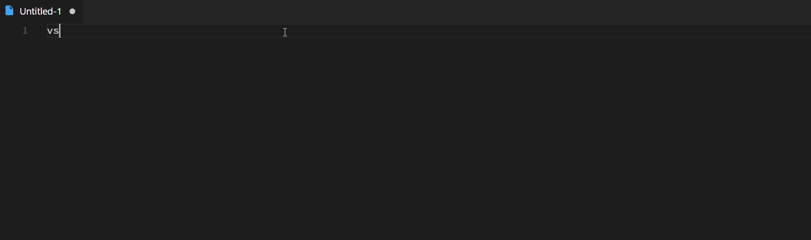

# FIGlet README

This extension is based on [FIGlet](http://www.figlet.org) and enables to create ASCII art text inside Visual Studio Code using various fonts. (See some examples [here](http://www.figlet.org/examples.html))

## How to use:

Choose a default Font using Command Palette => `FIGlet: choose font` (This setting is persisted)

Then position the cursor on a line of text you want to transform into ASCII art then either use the provided Shortcut `Alt+Shift+K` or invoke from the Command Palette => `FIGlet: create ASCII art text`

This extension contributes the following commands:

* `figlet.figlet`: create ASCII art text for the current line
* `figlet.chooseFont`: set the font to be used

This extension register the following key binding:
* `alt+shift+k`: invoke the `figlet.figlet` command
